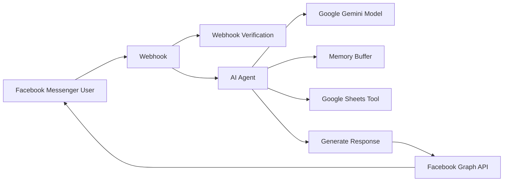

# 🤖 AI-Powered Facebook Messenger Chatbot using n8n & Google Gemini

An intelligent Facebook Messenger chatbot built with **n8n**, **Google Gemini AI**, and **Google Sheets** integration. The chatbot automatically receives messages from Facebook Messenger, processes them through an AI agent, maintains conversation memory, retrieves data from Google Sheets, and responds instantly to users.

---

## 🚀 Features

* 💬 Facebook Messenger Integration
* 🤖 AI-Powered Responses using Google Gemini
* 🧠 Conversation Memory Support
* 📊 Google Sheets Data Retrieval
* 🔄 Automated Message Processing
* ⚡ Real-Time Response Delivery
* 🛠️ No-Code/Low-Code Workflow with n8n

---

## 🏗️ Workflow Overview



---

## 📋 Components

### 1. Webhook

Receives incoming Facebook Messenger events and messages.

### 2. Verification Logic

Validates Facebook webhook requests using:

* `hub.mode = subscribe`
* Custom verification token

### 3. AI Agent

Processes user questions and generates intelligent responses.

**System Prompt**

```text
You are a helpful AI assistant
```

### 4. Google Gemini Chat Model

Provides the Large Language Model (LLM) capabilities for natural language understanding and response generation.

### 5. Simple Memory

Stores conversation context using the sender's Facebook ID, enabling more natural multi-turn conversations.

### 6. Google Sheets Tool

Allows the AI Agent to retrieve and analyze information stored in Google Sheets.

### 7. HTTP Request

Sends AI-generated responses back to Facebook Messenger using the Facebook Graph API.

---

## 🛠️ Tech Stack

| Technology             | Purpose             |
| ---------------------- | ------------------- |
| n8n                    | Workflow Automation |
| Google Gemini          | AI Processing       |
| Facebook Messenger API | Messaging Platform  |
| Google Sheets API      | Data Source         |
| HTTP Requests          | API Communication   |

---

## 📦 Prerequisites

Before running this workflow, make sure you have:

* n8n instance (Cloud or Self-hosted)
* Facebook Developer Account
* Facebook Page
* Google Gemini API Key
* Google Sheets OAuth Credentials

---

## ⚙️ Setup Instructions

### Step 1: Import Workflow

1. Open n8n.
2. Click **Import Workflow**.
3. Upload the provided JSON workflow file.

### Step 2: Configure Credentials

Add the following credentials:

* Google Gemini API
* Google Sheets OAuth2

### Step 3: Configure Facebook Messenger

Create a Facebook App and Messenger Webhook.

Set the webhook URL:

```text
https://your-domain.com/webhook/DailyGoods_messenger_bot
```

Set your verify token to match the workflow configuration.

### Step 4: Subscribe Messenger Events

Enable:

```text
messages
messaging_postbacks
```

### Step 5: Activate Workflow

Enable the workflow and send a message to your Facebook Page.

---

## 💡 Example Use Cases

### Student Information Bot

Users can ask:

```text
What is my grade?
```

The AI agent retrieves information from Google Sheets and returns the appropriate response.

### Customer Support Assistant

Users can ask:

```text
What are your business hours?
```

The AI agent responds automatically based on available data and context.

---

## 📂 Project Structure

```text
.
├── workflow.json
├── README.md
└── screenshots/
    └── workflow.png
```

---

## 🔒 Security Recommendations

Before publishing to GitHub:

* Remove all API keys and access tokens.
* Store secrets using n8n Credentials.
* Use environment variables where possible.
* Never commit Facebook Page Access Tokens to a public repository.

---

## 📈 Future Improvements

* Google Docs Integration
* Product Catalog Search
* Order Tracking System
* Multi-language Support
* Voice Message Processing
* Database Integration (MySQL/PostgreSQL)
* Image Analysis with Gemini Vision

---

## 👨‍💻 Author

**Nabil Thahamid Chowdhury**

Computer Science Student | Full-Stack Developer | AI Enthusiast

### Connect with me

* GitHub: `https://github.com/Nabilthahamid`
* LinkedIn: `https://www.linkedin.com/in/nabil-thamid-548842249/`

---

## ⭐ Support

If you found this project useful, consider giving it a ⭐ on GitHub.

---

## 📄 License

This project is licensed under the MIT License.
